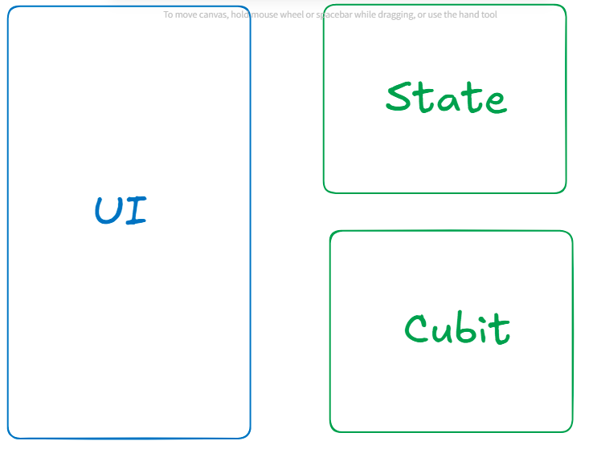
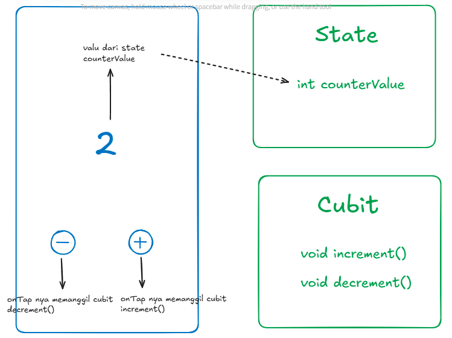

## 📌 Membuat Counter Cubit
Bikin Cubit itu langkah dasar buat mulai pakai pola state management Cubit di Flutter. Intinya, kita bikin sebuah class yang nyimpen state aplikasi, lalu di dalamnya ada method-method buat ngubah state tersebut.

Di materi ini, kita bakal bareng-bareng bikin CounterCubit, yang nanti jadi pondasi buat bikin aplikasi counter sederhana.
Kenapa ini penting? Karena paham cara bikin Cubit itu kunci biar kita bisa ngatur state di Flutter dengan rapi, terstruktur, predictable, dan gampang di-test.

### Konsep Counter App Cubit



##### 📚 Kita Akan Punya 3 Komponen Penting di Sini:
Nah, di konsep Cubit ini ada 3 komponen utama yang saling terhubung:

#### 🗂️ 1. State
👉 Komponen atau class yang menyimpan data atau nilai state yang nanti akan ditampilkan di UI.
Misalnya di sini kita punya:

counterValue berupa integer yang akan kita tampilkan di layar.

📌 Intinya: Tempat nyimpen data.
##
#### 🔄 2. Cubit
👉 Komponen atau class yang di dalamnya ada function atau logika bisnis yang mengatur perubahan nilai state tadi.
Di dalamnya ada:

- increment ➕ untuk menambah nilai state

- decrement ➖ untuk mengurangi nilai state

📌 Intinya: Tempat ngatur logika perubahan data.
##
#### 🎨 3. UI (User Interface)
👉 Bagian ini yang menampilkan state ke layar dan mentrigger function yang ada di dalam Cubit supaya state-nya berubah.

Contohnya:

- Tampil angka counter-nya.

- Ada tombol + buat panggil increment.

- Ada tombol – buat panggil decrement.

📌 Intinya: Tempat tampil dan interaksi user.

###
---
📝 Kesimpulan:
➡️ State: Nyimpen data
➡️ Cubit: Ngatur logika perubahan data
➡️ UI: Tampil & interaksi ke user


##


Package yang dibutuhkan
1. ```flutter_bloc```
2. ```bloc```
3. ```equatable```

Setelah itu kita akan membuat komponen State dan Cubit nya
##
### 1️⃣ Kita akan membuat terlebih dahulu komponen State nya berupa sebuah class tersendiri
Nah, di sini kita bakal belajar gimana kalau state-nya lebih kompleks atau multi-state — dan disimpan di class khusus.
##
##### ✅ Langkah-langkah Membuat Class State
Berikut tahapan yang perlu kita lakukan:
##
##### 📝 1. Buat Class CounterState
Pertama, kita buat dulu class-nya dan extends Equatable dan override method props seperti code dibawah ini :

```dart
import 'package:equatable/equatable.dart';

class CounterState extends Equatable {
  @override
  List<Object?> get props => [];
}
```
##
##### 🛠️ 2. Extends Equatable
Kita perlu extend class Equatable supaya state ini bisa dibandingkan dengan mudah (untuk keperluan rebuild UI).
##
##### ✍️ 3. Override Method props
props ini wajib di-override untuk menentukan property apa aja yang jadi bahan perbandingan antar state.
##
##### 🎯 4. Buat Property State & Constructor
Sekarang kita tambahkan property yang dibutuhkan (misalnya counterValue), plus constructor-nya, lengkap sama default value-nya:

```dart
class CounterState extends Equatable {
  const CounterState({
    this.counterValue = 0,
  });

  final int counterValue;

  @override
  List<Object?> get props => [counterValue];
}
```
📌 Keterangan:

- ```counterValue``` adalah nilai yang kita simpan.

- props harus berisi property yang akan dibandingkan.
##
##### ✨ 5. Buat Method copyWith()
Method ini dipakai buat menduplikasi state lama sambil mengganti nilai tertentu.
Gampangnya, biar kita bisa update sebagian isi state tanpa bikin ulang semua.

```dart
class CounterState extends Equatable {
  const CounterState({
    this.counterValue = 0,
  });

  final int counterValue;

  @override
  List<Object?> get props => [counterValue];

  CounterState copyWith({
    int? counterValue,
  }) {
    return CounterState(
      counterValue: counterValue ?? this.counterValue,
    );
  }
}
```
📌 Penjelasan:

- Kalau ```counterValue``` diisi, nilai itu yang dipakai.

- Kalau nggak diisi (null), tetap pakai nilai sebelumnya (this.counterValue).
---
#### ✅ Kesimpulan
- ➡️ Dengan begini, kita bisa punya state yang lebih fleksibel, bisa lebih dari satu property di satu class.
- ➡️ Tinggal pakai copyWith() untuk update sebagian nilai tanpa ganggu property lain.
#

#
### 2️⃣ Membuat CounterCubit dengan CounterState
Kalau tadi kita udah buat CounterState, sekarang waktunya bikin Cubit-nya yang akan mengatur perubahan state itu.
##
##### ✅ 1. Import Dulu yang Dibutuhin
```dart
import 'package:flutter_bloc/flutter_bloc.dart';
import 'counter_state.dart';
```
📌 Keterangan:

- ```flutter_bloc``` buat class Cubit

- ```counter_state.dart``` adalah file CounterState yang udah kita buat tadi.
##
##### ✅ 2. Buat Class CounterCubit
```dart
class CounterCubit extends Cubit<CounterState> {
  CounterCubit() : super(const CounterState());
}
```
📌 Penjelasan:

- ```extends Cubit<CounterState>``` artinya cubit ini pegang state bertipe CounterState

- ```super(const CounterState())``` artinya state awalnya pakai nilai default dari CounterState (yaitu counterValue = 0)
##
##### ✅ 3. Buat Method increment() & decrement()
```dart
void increment() {
  emit(state.copyWith(counterValue: state.counterValue + 1));
}

void decrement() {
  emit(state.copyWith(counterValue: state.counterValue - 1));
}
```
📌 Keterangan:

- ```emit()``` buat kirim state baru ke UI

- ```state.copyWith(...)``` untuk update counterValue tanpa mengubah state lain (kalau ada)
##
##### ✅ 4. Bonus: Method reset()
Karena kamu sempat tanya tadi, kalau mau reset state ke 0, tinggal gini aja:

```dart
void reset() {
  emit(const CounterState());
}
```
📌 Keterangan:

- ```emit(const CounterState())``` artinya balik ke state awal, yaitu counterValue = 0
##
##### ✅ 5. Full Code CounterCubit
```dart
import 'package:flutter_bloc/flutter_bloc.dart';
import 'counter_state.dart';

class CounterCubit extends Cubit<CounterState> {
  CounterCubit() : super(const CounterState());

  void increment() {
    emit(state.copyWith(counterValue: state.counterValue + 1));
  }

  void decrement() {
    emit(state.copyWith(counterValue: state.counterValue - 1));
  }

  void reset() {
    emit(const CounterState());
  }
}
```
##
🎉 Berhasil!
Sekarang kamu punya: ✅ CounterState buat nyimpan data
- ✅ CounterCubit buat atur perubahan state-nya
- ✅ reset(), increment(), decrement() yang tinggal dipanggil dari UI