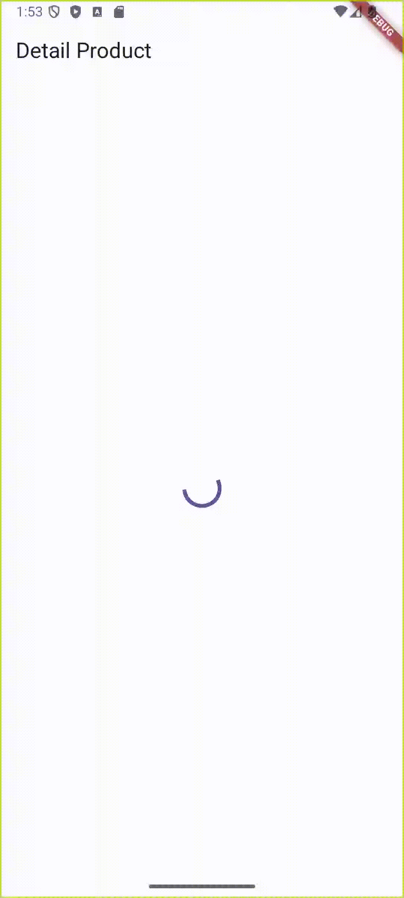

## 📚 Materi: Cara Get API dengan Cubit State Management di Flutter
---


### 🎯 Tujuan Materi
Belajar cara:

- Fetch data dari API Detail Product menggunakan Cubit

- Kelola state (loading, success, error)

- Tampilkan data produk ke UI

Seperti ini tampilan yang akan kita buat:




---
### 🧱 Struktur Komponen
Materi ini dibagi ke beberapa bagian:

- **Model** - Tempat nyimpan *response data* yang kita ambil dari API.

- **State** – Tempat nyimpan data & status.

- **Cubit** – Logic untuk fetch data dari API.

- **Service** – Tempat kita manggil API-nya.

- **UI (DetailProductScreen)** – Tempat tampilin hasilnya ke layar.


---

### 📦 Model: DetailProductModel
Disini kita akan membuat model untuk menampung data yang kita ambil dari API. Berikut adalah response data yang kita ambil dari API:

```json
{
  "id": 1,
  "title": "Fjallraven - Foldsack No. 1 Backpack, Fits 15 Laptops",
  "price": 109.95,
  "description": "Your perfect pack for everyday use and walks in the forest. Stash your laptop (up to 15 inches) in the padded sleeve, your everyday",
  "category": "men's clothing",
  "image": "https://fakestoreapi.com/img/81fPKd-2AYL._AC_SL1500_.jpg",
  "rating": {
    "rate": 3.9,
    "count": 120
  }
}
```

Lalu kita buat modelnya di dalam folder `models` di dalam folder `lib`. Kamu bisa membuat model nya dengan cara manual atau menggunakan generator. Berikut adalah hasil model yang akan kita buat : 

```dart
import 'dart:convert';

import 'package:equatable/equatable.dart';

import 'rating.dart';

class DetailProductModel extends Equatable {
  final int? id;
  final String? title;
  final double? price;
  final String? description;
  final String? category;
  final String? image;
  final Rating? rating;

  const DetailProductModel({
    this.id,
    this.title,
    this.price,
    this.description,
    this.category,
    this.image,
    this.rating,
  });

  factory DetailProductModel.fromMap(Map<String, dynamic> data) {
    return DetailProductModel(
      id: data['id'] as int?,
      title: data['title'] as String?,
      price: (data['price'] as num?)?.toDouble(),
      description: data['description'] as String?,
      category: data['category'] as String?,
      image: data['image'] as String?,
      rating:
          data['rating'] == null
              ? null
              : Rating.fromMap(data['rating'] as Map<String, dynamic>),
    );
  }

  Map<String, dynamic> toMap() => {
    'id': id,
    'title': title,
    'price': price,
    'description': description,
    'category': category,
    'image': image,
    'rating': rating?.toMap(),
  };

  /// `dart:convert`
  ///
  /// Parses the string and returns the resulting Json object as [DetailProductModel].
  factory DetailProductModel.fromJson(String data) {
    return DetailProductModel.fromMap(
      json.decode(data) as Map<String, dynamic>,
    );
  }

  /// `dart:convert`
  ///
  /// Converts [DetailProductModel] to a JSON string.
  String toJson() => json.encode(toMap());

  DetailProductModel copyWith({
    int? id,
    String? title,
    double? price,
    String? description,
    String? category,
    String? image,
    Rating? rating,
  }) {
    return DetailProductModel(
      id: id ?? this.id,
      title: title ?? this.title,
      price: price ?? this.price,
      description: description ?? this.description,
      category: category ?? this.category,
      image: image ?? this.image,
      rating: rating ?? this.rating,
    );
  }

  @override
  bool get stringify => true;

  @override
  List<Object?> get props {
    return [id, title, price, description, category, image, rating];
  }
}


class Rating extends Equatable {
  final double? rate;
  final int? count;

  const Rating({this.rate, this.count});

  factory Rating.fromMap(Map<String, dynamic> data) => Rating(
    rate: (data['rate'] as num?)?.toDouble(),
    count: data['count'] as int?,
  );

  Map<String, dynamic> toMap() => {'rate': rate, 'count': count};

  /// `dart:convert`
  ///
  /// Parses the string and returns the resulting Json object as [Rating].
  factory Rating.fromJson(String data) {
    return Rating.fromMap(json.decode(data) as Map<String, dynamic>);
  }

  /// `dart:convert`
  ///
  /// Converts [Rating] to a JSON string.
  String toJson() => json.encode(toMap());

  Rating copyWith({double? rate, int? count}) {
    return Rating(rate: rate ?? this.rate, count: count ?? this.count);
  }

  @override
  bool get stringify => true;

  @override
  List<Object?> get props => [rate, count];
}
```

---

### 📦 ProductService: Nge-GET Data ke API

Buat sebuah folder `services` di dalam folder `lib` dan buat file baru bernama `product_service.dart`. Di sini kita akan bikin class `ProductService` yang bertugas untuk nge-GET data dari API. 

BaseURL yang kita pakai adalah `https://fakestoreapi.com/products/1`. 

```dart
class ProductService {

    final Dio dio = Dio(); // Inisialisasi Dio untuk HTTP requests

    Future<Either<String, DetailProductModel>> fetchProductDetail() async {
        try {
            var response = await dio.get('https://fakestoreapi.com/products/1');

            if (response.statusCode == 200) {
                var data = DetailProductModel.fromMap(response.data);// Convert data ke model DetailProductModel
                return Right(data); // Kalau berhasil
            } else {
             return Left('Gagal menampilkan product data'); // Kalau gagal
            }
        } on DioException catch (e) {
            return Left('Error : ${e.message}'); // Kalau error network
        }
    }
}
```

#### Penjelasan:
- **Dio**: Library untuk HTTP requests. Kita pakai ini buat nge-GET data dari API.
  ######
- **fetchProductDetail()**: Method ini nge-GET data dari API. Kalo berhasil, kita convert ke model `DetailProductModel` dan kembalikan. Kalo gagal, kita kembalikan pesan error.
- **Either**: Kita pakai `Either` buat ngembalikan dua kemungkinan: sukses (Right) atau gagal (Left). Ini bikin kode kita lebih bersih dan mudah dibaca.
- ```Future<Either<String, DetailProductModel>>```: Ini adalah tipe data yang kita kembalikan dari method ini. Kita bisa dapet dua kemungkinan: String (pesan error) atau `DetailProductModel` (data produk). Ini bikin kode kita lebih fleksibel dan mudah dibaca.
- ```var response = await dio.get('https://fakestoreapi.com/products/1');``` : Ini adalah request ke API. Kita ambil data produk dengan ID 1. dan kita simpan di variabel `response`.
- **response.statusCode**: Kita cek status code dari response. Kalo 200, berarti sukses. Kalo bukan, kita anggap gagal.
- ```var data = DetailProductModel.fromMap(response.data);``` : Kita convert data dari response ke model `DetailProductModel`. lalu kita simpan di variabel `data`. ```response.data``` adalah data yang kita ambil dari API yang sudah disimpan di variabel `response`.
- ```return Right(data);``` : Kita kembalikan data produk yang sudah di-convert ke model `DetailProductModel`.
- ```return Left('Gagal menampilkan product data');``` : Kita kembalikan pesan error kalo gagal nge-GET data dari API.
---
### 🎨 ProductState: Nyimpen State-nya

Kita akan membuat state untuk menampung data yang kita ambil dari API. 

```dart
class ProductState extends Equatable {
  const ProductState({
    this.detailProduct = const DetailProductModel(),
    this.isLoading = false,
    this.error = '',
  });

  final DetailProductModel detailProduct;
  final bool isLoading;
  final String error;

  @override
  List<Object> get props => [detailProduct, isLoading, error];

  ProductState copyWith({
    DetailProductModel? detailProduct,
    bool? isLoading,
    String? error,
  }) {
    return ProductState(
      detailProduct: detailProduct ?? this.detailProduct,
      isLoading: isLoading ?? this.isLoading,
      error: error ?? this.error,
    );
  }
}

```

#### Penjelasan:
- **detailProduct**: Menyimpan data produk yang kita ambil dari API. Kita inisialisasi dengan model `DetailProductModel()` yang kosong.
- **isLoading**: Menyimpan status loading. Kita inisialisasi dengan `false` karena awalnya kita belum nge-GET data.
- **error**: Menyimpan pesan error. Kita inisialisasi dengan string kosong karena awalnya kita belum ada error.
- **copyWith()**: Method ini dipakai buat menduplikasi state lama sambil mengganti nilai tertentu. Gampangnya, biar kita bisa update sebagian isi state tanpa bikin ulang semua.
- **props**: Ini adalah list yang berisi property yang akan dibandingkan. Kita pakai ini buat ngecek apakah state kita berubah atau enggak. Kalo ada yang berubah, UI kita akan di-update.
- **Equatable**: Kita pakai ini buat membandingkan state kita. Jadi, kita bisa tau kapan state kita berubah dan UI kita perlu di-update.
- **const**: Kita pakai ini buat bikin state kita immutable. Jadi, kita nggak bisa ngubah state secara langsung. Kita harus bikin state baru dengan method `copyWith()`.

---
### ⚙️ ProductCubit: Handle Logic & Ubah State

Kita akan membuat cubit untuk mengatur state dan nge-GET data dari API. 

```dart

class ProductCubit extends Cubit<ProductState> {
  ProductCubit() : super(ProductState());

  Future<void> getProductData() async {
    emit(state.copyWith(isLoading: true));

    var data = await ProductService().fetchProductDetail();

    data.fold(
      (left) => emit(state.copyWith(error: left)),
      (right) => emit(state.copyWith(detailProduct: right)),
    );

    emit(state.copyWith(isLoading: false));
  }
}
```

#### Penjelasan:
- **ProductCubit**: Ini adalah class yang kita buat untuk mengatur state dan nge-GET data dari API. Kita turunkan dari `Cubit<ProductState>` yang udah kita buat sebelumnya.
- **getProductData()**: Ini adalah method yang kita buat untuk nge-GET data dari API. Kita panggil method ini di UI untuk nge-GET data.
- **emit()**: Ini adalah method yang kita pakai untuk ngubah state. Kita panggil ini setiap kali kita mau ngubah state.
- **state.copyWith(isLoading: true)**: Kita panggil ini untuk ngubah state jadi loading. Kita set `isLoading` jadi `true`.
- **var data = ProductService().fetchProductDetail()**: Kita panggil method ini untuk nge-GET data dari API Service yang sudah kita buat sebelumnya. Kita panggil class `ProductService()` lalu kita panggil method `fetchProductDetail()` . Lalu hasilnya Kita simpan di variabel `data`.
- **data.fold()**: Kita pakai ini untuk ngecek apakah kita dapet data atau error. Kalo dapet error, kita emit state dengan pesan error. Kalo dapet data, kita emit state dengan data produk yang kita dapet.
- **emit(state.copyWith(isLoading: false))**: Kita panggil ini untuk ngubah state jadi nggak loading lagi. Kita set `isLoading` jadi `false`.

---

### 📱 UI: DetailProductScreen

Kita akan membuat UI untuk menampilkan data produk yang kita ambil dari API. Kita akan menggunakan `BlocBuilder` untuk mendengarkan perubahan state dari `ProductCubit` dan menampilkan data ke UI.

```dart
class DetailProductScreen extends StatelessWidget {
  const DetailProductScreen({super.key});

  @override
  Widget build(BuildContext context) {
    return BlocProvider(create: (context) => ProductCubit(), child: _Content());
  }
}

class _Content extends StatefulWidget {
  const _Content();

  @override
  State<_Content> createState() => _ContentState();
}

class _ContentState extends State<_Content> {
  @override
  void initState() {
    super.initState();
    context.read<ProductCubit>().getProductData();
  }

  @override
  Widget build(BuildContext context) {
    return Scaffold(
      backgroundColor: Colors.white,
      appBar: AppBar(
        title: Text('Detail Product'),
        backgroundColor: Colors.white,
      ),
      body: BlocBuilder<ProductCubit, ProductState>(
        builder: (context, state) {
          if (state.isLoading) {
            return Center(child: CircularProgressIndicator());
          } else if (state.error != '') {
            return Center(child: Text(state.error));
          } else {
            return Padding(
              padding: const EdgeInsets.all(16.0),
              child: SingleChildScrollView(
                child: Column(
                  children: [
                    Image.network(
                      state.detailProduct.image ?? '',
                      fit: BoxFit.cover,
                      height: 400,
                    ),
                    const SizedBox(height: 30.0),
                    Text(
                      state.detailProduct.title ?? '-',
                      style: const TextStyle(
                        fontSize: 20,
                        fontWeight: FontWeight.bold,
                      ),
                    ),
                    const SizedBox(height: 8.0),
                    Text(
                      state.detailProduct.description ?? '-',
                      style: const TextStyle(fontSize: 14),
                    ),
                  ],
                ),
              ),
            );
          }
        },
      ),
    );
  }
}
```
#### Penjelasan:
```dart
BlocProvider(create: (context) => ProductCubit(), child: _Content());
```
- Kita pakai `BlocProvider` buat nyediain `ProductCubit` ke widget anaknya (`_Content`). Jadi, kita bisa akses `ProductCubit` di dalam `_Content` dan semua widget anaknya.
  
```dart
@override
  void initState() {
    super.initState();
    context.read<ProductCubit>().getProductData();
  }
```
- Kita override `initState()` buat manggil method `getProductData()` dari `ProductCubit`. Ini supaya kita bisa nge-GET data dari API pas widget pertama kali dibangun atau pas masuk ke layar ini.
  
```dart
BlocBuilder<ProductCubit, ProductState>(
        builder: (context, state) {
          if (state.isLoading) {
            return Center(child: CircularProgressIndicator());
          } else if (state.error != '') {
            return Center(child: Text(state.error));
          } else {
            return Padding(
              padding: const EdgeInsets.all(16.0),
              child: SingleChildScrollView(
                child: Column(
                  children: [
                    Image.network(
                      state.detailProduct.image ?? '',
                      fit: BoxFit.cover,
                      height: 400,
                    ),
                    const SizedBox(height: 30.0),
                    Text(
                      state.detailProduct.title ?? '-',
                      style: const TextStyle(
                        fontSize: 20,
                        fontWeight: FontWeight.bold,
                      ),
                    ),
                    const SizedBox(height: 8.0),
                    Text(
                      state.detailProduct.description ?? '-',
                      style: const TextStyle(fontSize: 14),
                    ),
                  ],
                ),
              ),
            );
          }
        },
      ),
```
- Kita pakai `BlocBuilder` buat ngedengerin perubahan state dari `ProductCubit`. Kalo state-nya loading, kita tampilkan `CircularProgressIndicator`. Kalo ada error, kita tampilkan pesan error. Kalo berhasil, kita tampilkan gambar produk, judul, dan deskripsi produk.
- Kita pakai `SingleChildScrollView` supaya kalo kontennya lebih panjang dari layar, kita bisa scroll ke bawah.